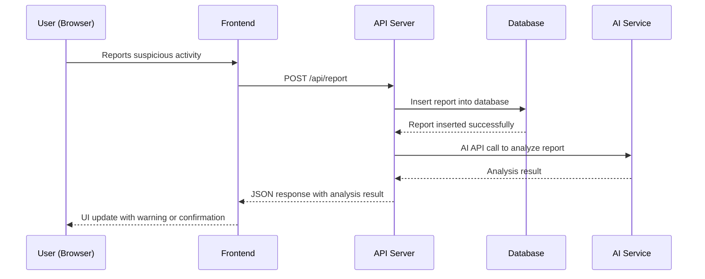
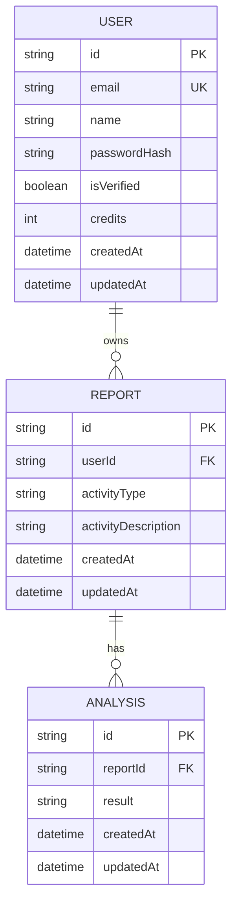

# Scam Detector
### MVP Architecture Document
> **Team:** talha · **Duration:** 12 weeks · **Stack:** Next.js, React, TypeScript, Machine Learning

---

## 1. Executive Summary
The Scam Detector is a web application designed to protect users from online scams by utilizing machine learning algorithms to detect and prevent fraudulent activities. The application will analyze user reports and feedback to improve its detection accuracy and provide personalized warnings to users. The core problem it solves is the lack of proactive measures in detecting online scams, which often result in significant financial losses for individuals.

The Scam Detector will deliver value to its users by providing a safe and secure platform for online transactions. The application will enable users to report suspicious activities, which will be analyzed by the machine learning algorithm to determine the legitimacy of the activity. The algorithm will then provide a warning to the user if the activity is deemed suspicious.

The end-user experience will involve a simple and intuitive interface where users can report suspicious activities and receive warnings. The application will also provide educational resources to help users identify potential scams and take proactive measures to protect themselves.

## 2. System Architecture Overview

### 2.1 High-Level Architecture Diagram
```
┌─────────────────────────────────┐
│         React / Next.js         │  ← actual frontend tech
└────────────┬────────────────────┘
             │ HTTPS / REST
┌────────────▼────────────────────┐
│      Express.js API Server      │
│  ┌──────────┐  ┌─────────────┐  │
│  │  Routes  │  │  Middleware │  │
│  └──────────┘  └─────────────┘  │
│  ┌──────────────────────────┐   │
│  │     Service Layer        │   │
│  └──────────────────────────┘   │
└───┬──────────────┬──────────────┘
    │              │
┌───▼───┐    ┌─────▼──────┐
│MongoDB│    │ External   │
│ Atlas │    │ APIs (AI)  │
└───────┘    └────────────┘
```

### 2.2 Request Flow Diagram (Mermaid)


### 2.3 Architecture Pattern
The Scam Detector will follow a layered architecture pattern, which suits the team size and timeline. The layered architecture will consist of a presentation layer (React/Next.js), an application layer (Express.js API Server), a business logic layer (Service Layer), and a data access layer (Database and External APIs).

### 2.4 Component Responsibilities
The React/Next.js frontend will be responsible for handling user input, displaying warnings and confirmations, and managing the user interface. The Express.js API Server will handle API requests, interact with the database and external APIs, and provide authentication and authorization. The Service Layer will contain the business logic for analyzing reports and determining the legitimacy of activities. The Database will store reports, user data, and analysis results. The External APIs will provide machine learning capabilities for analyzing reports.

## 3. Tech Stack & Justification

| Layer | Technology | Why chosen |
|-------|-----------|------------|
| Frontend | React/Next.js | Chosen for its simplicity, flexibility, and large community support |
| API Server | Express.js | Chosen for its lightweight, flexible, and modular architecture |
| Service Layer | TypeScript | Chosen for its strong typing, scalability, and maintainability |
| Database | MongoDB | Chosen for its flexible schema, high performance, and ease of use |
| External APIs | Machine Learning APIs | Chosen for their ability to analyze reports and determine legitimacy |

## 4. Database Design

### 4.1 Entity-Relationship Diagram


### 4.2 Relationship & Association Details
The relationship between REPORT and ANALYSIS is driven by the business rule that each report must be analyzed to determine its legitimacy. The cardinality is one-to-zero-or-one, meaning each report can have at most one analysis. The join strategy is to populate the analysis result into the report document. The cascade behavior on delete is to delete the analysis when the report is deleted.

The relationship between USER and REPORT is driven by the business rule that each report is owned by a user. The cardinality is one-to-zero-or-many, meaning each user can have multiple reports. The join strategy is to populate the user's reports into the user document. The cascade behavior on delete is to delete the reports when the user is deleted.

### 4.3 Schema Definitions (Code)
```typescript
const reportSchema = new Schema({
  userId: { type: String, required: true, ref: 'User' },
  activityType: { type: String, required: true },
  activityDescription: { type: String, required: true },
  createdAt: { type: Date, default: Date.now },
  updatedAt: { type: Date, default: Date.now },
}, { timestamps: true });

const userSchema = new Schema({
  email: { type: String, required: true, unique: true, lowercase: true },
  name: { type: String, required: true },
  passwordHash: { type: String, required: true },
  isVerified: { type: Boolean, default: false },
  credits: { type: Number, default: 0 },
  createdAt: { type: Date, default: Date.now },
  updatedAt: { type: Date, default: Date.now },
}, { timestamps: true });

const analysisSchema = new Schema({
  reportId: { type: String, required: true, ref: 'Report' },
  result: { type: String, required: true },
  createdAt: { type: Date, default: Date.now },
  updatedAt: { type: Date, default: Date.now },
}, { timestamps: true });
```

### 4.4 Indexing Strategy
The indexing strategy for the reports collection will include a single index on the userId field and a compound index on the activityType and activityDescription fields. The indexing strategy for the users collection will include a unique index on the email field.

### 4.5 Data Flow Between Entities
When a user reports a suspicious activity, the report is inserted into the reports collection. The report is then analyzed by the machine learning algorithm, and the analysis result is inserted into the analyses collection. The analysis result is then populated into the report document. When a user is deleted, all their reports are deleted, and when a report is deleted, its analysis is also deleted.

## 5. API Design

### 5.1 Authentication & Authorization
The authentication mechanism will be based on JSON Web Tokens (JWT). The user will receive a JWT token after successful login, which will be verified on each protected route.

### 5.2 REST Endpoints
| Method | Path | Auth | Request Body | Response | Description |
|--------|------|------|--------------|----------|-------------|
| POST | /api/report | Required | { activityType, activityDescription } | { reportId } | Create a new report |
| GET | /api/reports | Required | - | [ reports ] | Get all reports for the current user |
| GET | /api/analysis | Required | - | { analysisResult } | Get the analysis result for a report |

### 5.3 Error Handling
The standard error response format will be a JSON object with a message and a status code. The HTTP status codes used will be 200 OK, 400 Bad Request, 401 Unauthorized, and 500 Internal Server Error.

## 6. Frontend Architecture

### 6.1 Folder Structure
The src/ directory tree will have the following structure:
```bash
src/
components/
ReportForm.js
ReportsList.js
AnalysisResult.js
containers/
App.js
ReportPage.js
AnalysisPage.js
actions/
reportActions.js
analysisActions.js
reducers/
reportReducer.js
analysisReducer.js
index.js
```

### 6.2 State Management
The global state will be managed by Redux, with separate reducers for reports and analysis. The local state will be managed by React components.

### 6.3 Key Pages & Components
The key pages will be the Report Page and the Analysis Page. The main components will be the Report Form, Reports List, and Analysis Result.

## 7. Core Feature Implementation

### 7.1 Scam Detection Algorithm
The scam detection algorithm will be implemented using a machine learning model. The user flow will involve the user reporting a suspicious activity, which will trigger the scam detection algorithm. The frontend will handle the user input and display the warning or confirmation.

The API call will be to the /api/analysis endpoint, which will trigger the scam detection algorithm. The backend logic will involve analyzing the report using the machine learning model and returning the analysis result.

The database will store the reports and analysis results. The AI integration will be using a machine learning API to analyze the reports.

The code snippet for the scam detection algorithm will be:
```typescript
const analyzeReport = async (report: Report) => {
  const analysisResult = await machineLearningAPI.analyzeReport(report);
  return analysisResult;
};
```

### 7.2 User Reporting and Feedback
The user reporting and feedback feature will involve the user reporting a suspicious activity, which will trigger the scam detection algorithm. The frontend will handle the user input and display the warning or confirmation.

The API call will be to the /api/report endpoint, which will create a new report. The backend logic will involve storing the report in the database and triggering the scam detection algorithm.

The database will store the reports and analysis results.

The code snippet for the user reporting and feedback feature will be:
```typescript
const createReport = async (report: Report) => {
  const reportId = await reportsCollection.insertOne(report);
  return reportId;
};
```

## 8. Security Considerations

The security considerations will include input validation, authentication token storage, CORS policy, rate limiting, file upload safety, and environment secrets management. The input validation will be done using Joi, and the authentication token storage will be done using a secure cookie. The CORS policy will be set to only allow requests from the frontend domain. The rate limiting will be done using a Redis cache. The file upload safety will be done by only allowing specific file types and validating the file contents. The environment secrets management will be done using a secrets manager.

## 9. MVP Scope Definition

### 9.1 In Scope (MVP)
The MVP will include the following features:
* Scam detection algorithm
* User reporting and feedback
* Analysis result display
* User authentication and authorization

### 9.2 Out of Scope (Post-MVP)
The post-MVP features will include:
* Machine learning model training
* Integration with external APIs
* Advanced analytics and reporting

### 9.3 Success Criteria
The success criteria for the MVP will be:
* The scam detection algorithm is able to accurately detect scams with a high degree of accuracy
* The user reporting and feedback feature is user-friendly and easy to use
* The analysis result display is clear and concise
* The user authentication and authorization is secure and works as expected

## 10. Week-by-Week Implementation Plan

The implementation plan will be as follows:
Week 1-2: Set up the project structure and initialize the database
Week 3-4: Implement the user authentication and authorization feature
Week 5-6: Implement the scam detection algorithm and user reporting and feedback feature
Week 7-8: Implement the analysis result display feature
Week 9-10: Test and debug the application
Week 11-12: Deploy the application and finalize the MVP

## 11. Testing Strategy

| Type | Tool | What is tested | Target coverage |
|------|------|---------------|-----------------|
| Unit | Jest | Individual components and functions | 80% |
| Integration | Cypress | API endpoints and user flows | 70% |
| End-to-end | Cypress | Entire application | 60% |

## 12. Deployment & DevOps

### 12.1 Local Development Setup
The local development setup will involve cloning the repository, installing dependencies, and running the application using `npm start`.

### 12.2 Environment Variables
The environment variables will include:
* `MONGO_URI`: the MongoDB connection string
* `JWT_SECRET`: the secret key for JWT authentication
* `ML_API_KEY`: the API key for the machine learning API

### 12.3 Production Deployment
The production deployment will be done using a CI/CD pipeline, which will build and deploy the application to a cloud platform.

## 13. Risk Register

| Risk | Likelihood | Impact | Mitigation |
|------|-----------|--------|-----------|
| Machine learning model accuracy | High | High | Continuously monitor and improve the model |
| User adoption | Medium | Medium | Provide a user-friendly interface and clear instructions |
| Security vulnerabilities | High | High | Implement robust security measures and continuously monitor for vulnerabilities |
| Database performance | Medium | Medium | Optimize database queries and indexing |
| Integration with external APIs | Medium | Medium | Test and debug API integrations thoroughly |